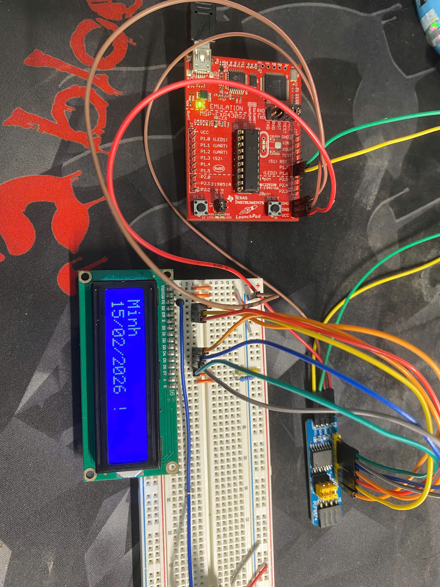

# MSP430 Learning

This repository documents my personal process of learning the **MSP430G2553** microcontroller.

## Description
I am currently exploring the MSP430 architecture.
This repo contains my raw code, failed experiments, and notes as I try to understand how the hardware works from scratch.

## Status
* **Stage**: Beginner / Learning
* **Goal**: To write bare-metal drivers without relying on existing libraries.

## Learning Log
- [x] **01:** Blinking LED
- [x] **02:** Debounce button using Timer and Interrupt
- [x] **03:** Display LCD by using PCF8574 (I/O expander) and I2C polling
  

  

- [x] **04:** Display LCD by using PCF8574(I/O expander) and I2C interrupt 
---
*Minh*